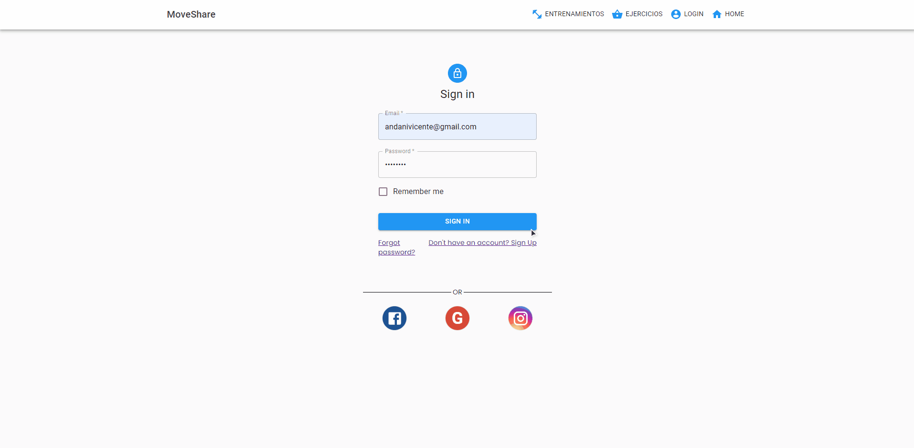
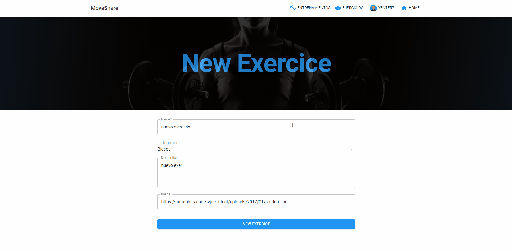
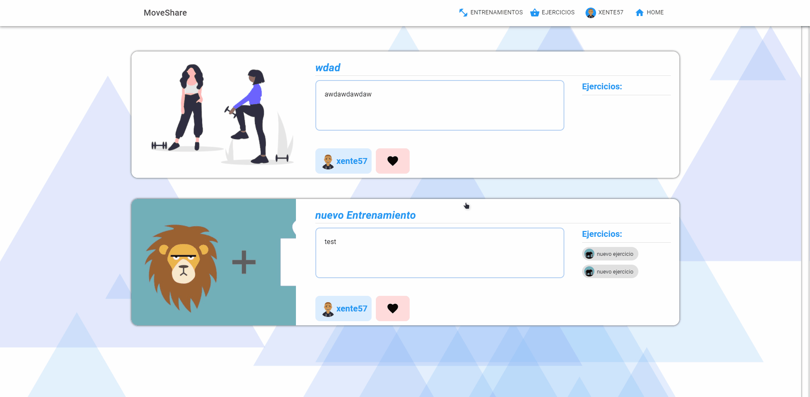
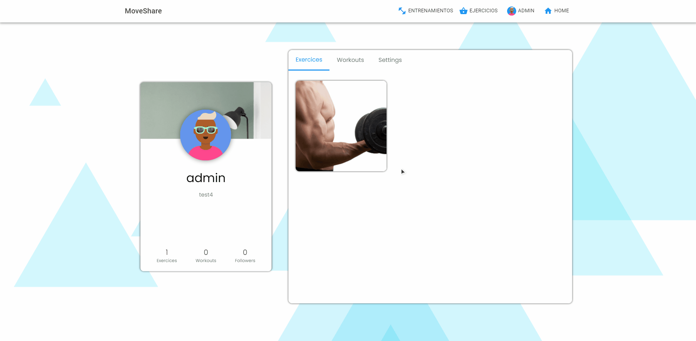

<h1 align="center">Welcome to Moveshare 👋</h1>
<p>
</p>

> A social network where you can share and view exercises and trainings with other people

## Install

To run the project we will have to have docker-compose (version 1.27) installed.

Once installed we will have to run docker-compose up to start the containers.

Next we will enter the backend container (Django) and execute:

```sh
python3 manage.py migrate
```

To access the administrator functions we will also have to create a superuser.

```sh
python3 manage.py createsuperuser
```

## Usage

```sh
docker-compose up
```

## Some previews 📷

### Home - Menu


### Login - Register



### Create Exercice



### Exercice List, Favs and Preview


### Create Workout


### Workout List and Preview



### Profiles


### Panel Admin



## Built with 🛠️
* [REACT HOOKS](https://es.reactjs.org/)
* [Django](https://www.djangoproject.com/)
* [Postgresql](https://www.postgresql.org/)

## Author

👤 **Vicente Andani**

* Website: https://vicnx.github.io/Curriculum/
* Github: [@vicnx](https://github.com/vicnx)
* LinkedIn: [@vicnx](https://linkedin.com/in/vicnx)


## Show your support

Give a ⭐️ if this project helped you!